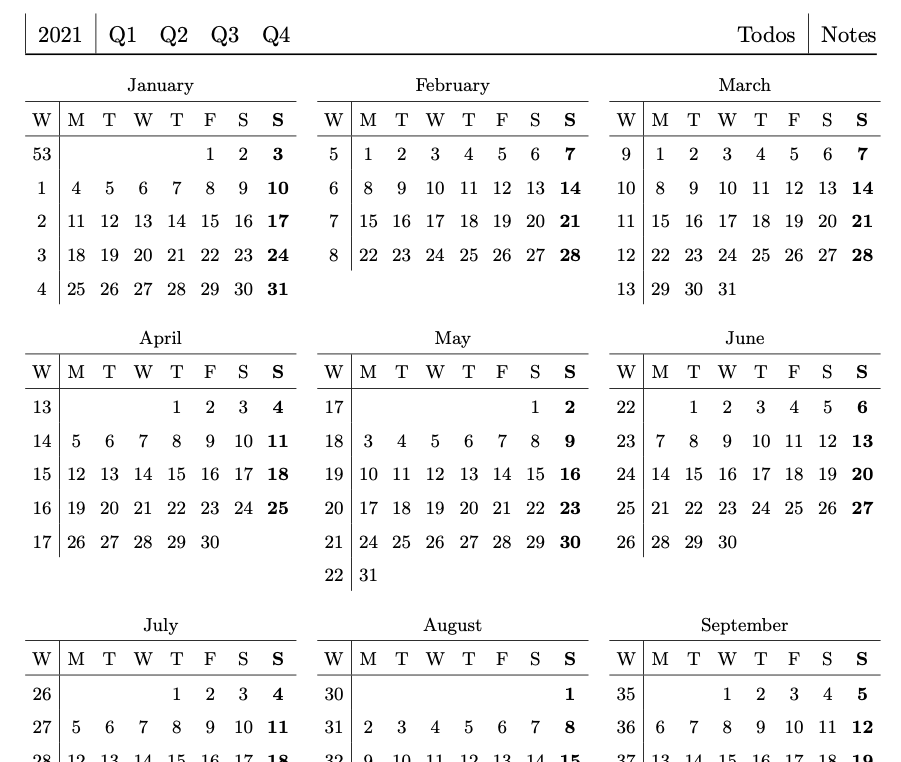
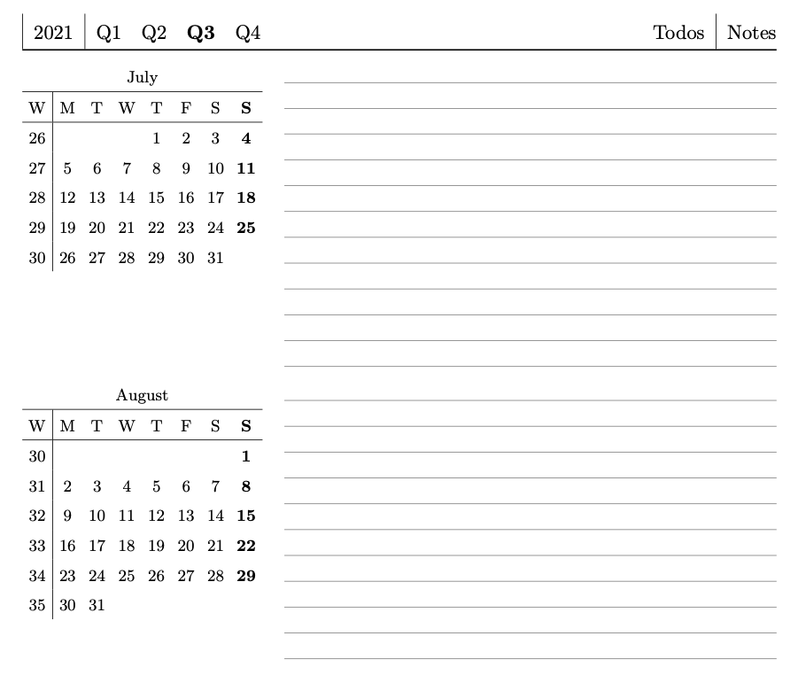
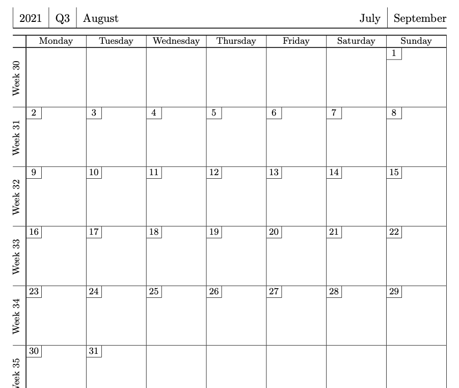
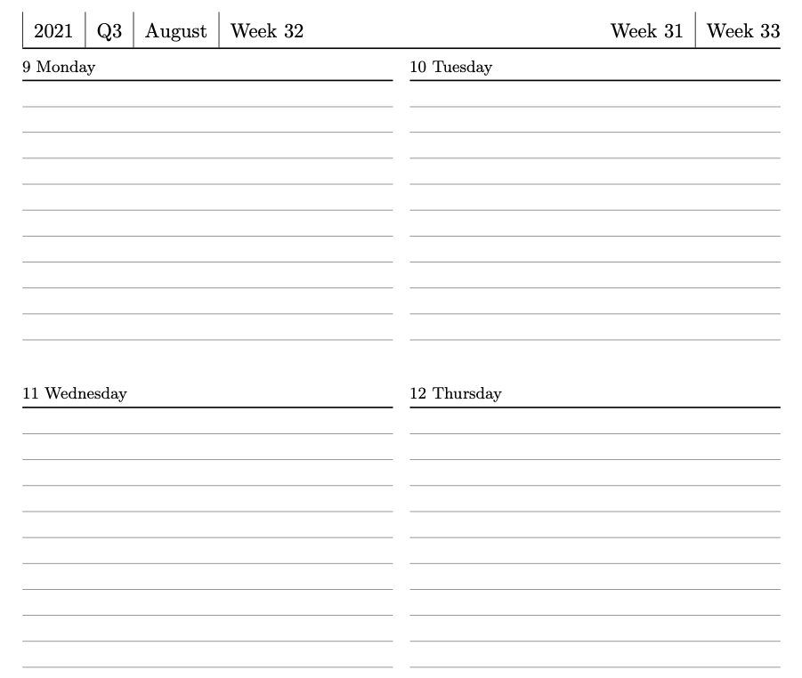
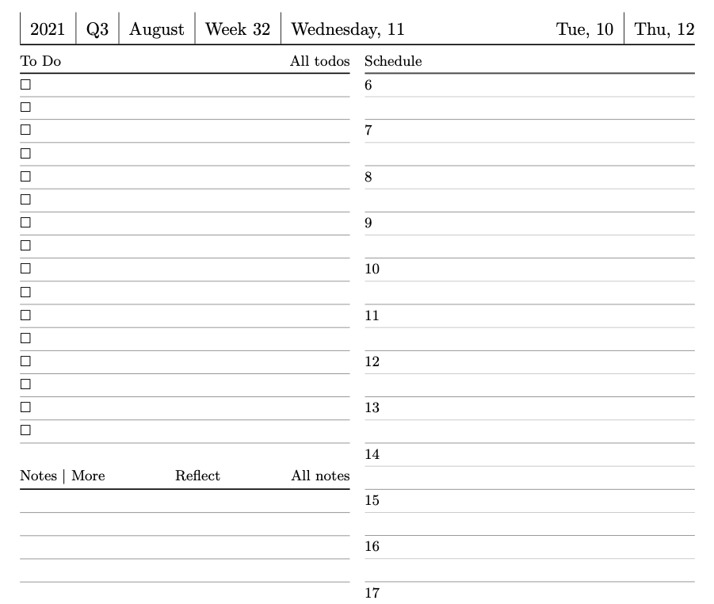

# latex-yearly-planner

PDF planner designed for e-ink devices.

Download latest PDF with newest features and best bugs
[from the latest release](https://github.com/kudrykv/latex-yearly-planner/releases).

# Preview examples

# The code
The code is a horrible mess.
The idea is to get the idea what the need is, what configurable options are,
and rewrite this in a better way at some point.
Current goal is to get something useful out of it, and prettify the repo itself later.

Read `build.sh` to get an idea how to build it on your own.
